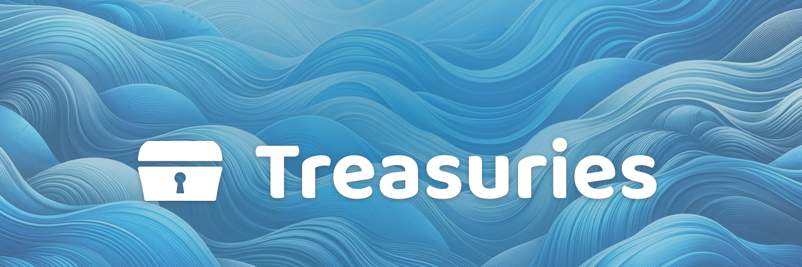

# About

<figure><figcaption></figcaption></figure>

These resources aim to provide insightful and actionable information about how Web3 ecosystem treasuries can be maintained and improved. These resources could be useful for anyone interested in learning about treasuries!&#x20;

The resources will mostly focus on Web3 ecosystems, exploring different treasury development opportunities and approaches.

These resources are provided as a public good to help benefit any nation, organisation or emerging Web3 community.

**Current contributors**


[Web3 Association](https://app.gitbook.com/o/jOQu4b6VLDxaQsg2rVwG/s/zQLAwDu1M3Ts4d7syiK4/)

