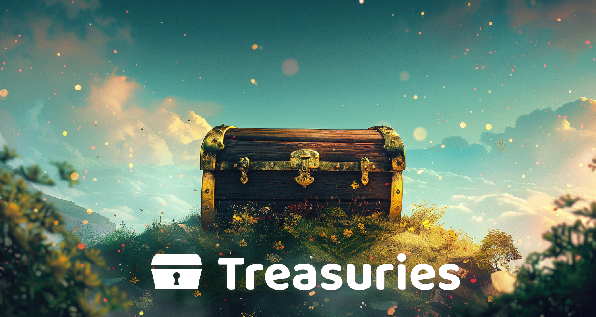

# About

<figure><figcaption></figcaption></figure>

Educational resources that aim to provide insightful and actionable information about Web3 treasuries. These resources focus on Web3 ecosystem treasuries and the different opportunities and approaches that could be adopted. The majority of the analysis so far has been focused on [funding](https://app.gitbook.com/o/jOQu4b6VLDxaQsg2rVwG/s/8L61e8ulVlk90t5mlQk1/) processes.

**Current contributors**


[Web3 Association](https://app.gitbook.com/o/jOQu4b6VLDxaQsg2rVwG/s/zQLAwDu1M3Ts4d7syiK4/)

