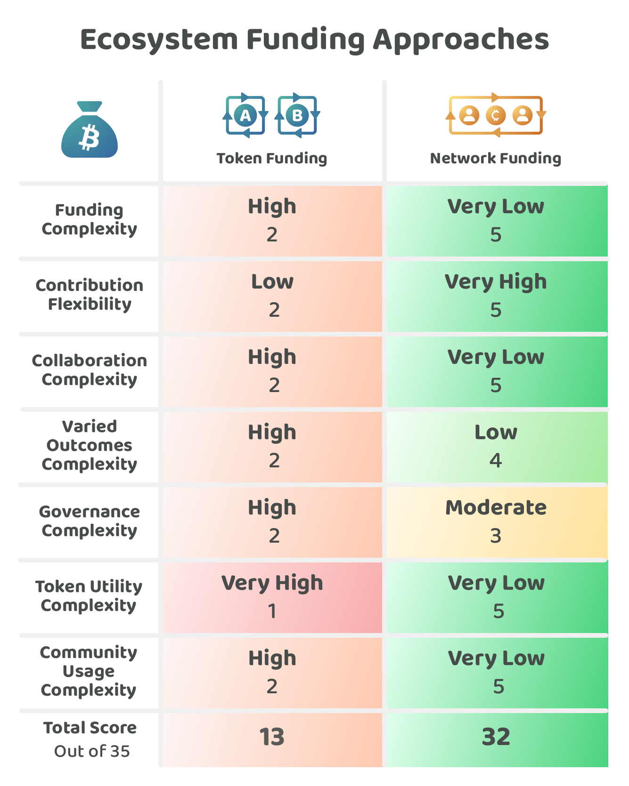

# Idea token vs contributor network funding

<figure><figcaption></figcaption></figure>

Ecosystem contributors need a sustainable way to fund their ongoing contribution efforts to execute impactful ideas. Two approaches that can be compared are token based funding, where projects raise investment from minting a project token and contributor network funding, where a networks treasury funds contributors directly to work on ecosystem initiatives.

Over the previous years token based funding has been a popular way for projects to raise funding to pay for execution efforts. Network contributor funding is not as widely seen across Web3 ecosystems. This suggested approach has emerged after analysing the different ways a networks treasury could handle disbursement. Open source contributor funding emerged as a promising approach for compensating contributors that execute different ideas across the network. This analysis will ignore network idea funding as this approach and the problems it has are already well covered across the disbursement analysis resources:


[Disbursement](https://app.gitbook.com/o/jOQu4b6VLDxaQsg2rVwG/s/8L61e8ulVlk90t5mlQk1/)


Both of these approaches can represent a circular economy. Network treasuries can generate income from network transaction fees which then can help to fund initiatives that increase the amount of use cases and adoption. Tokens issued by projects can also introduce token based fees that users would pay when using their protocols and applications. These circular based economies can be an important part of making a sustainable model for generating income over the long term that can help with maintaining and improving the network itself, protocols and applications across the ecosystem. It is worth thinking about some of the ideas that can be implemented in Web3 ecosystems and consider how these ideas may or may not be suitable as a circular economy:


[circular-economy-ideas.md](../funding/idea-token-vs-contributor-network-funding/circular-economy-ideas.md)


Web3 ecosystems can benefit from considering the different open source libraries that exist in Web2 environments such as internet protocols, utility libraries and front end and back end frameworks. These considerations can help us with thinking about the potential importance of funding open source initiatives in Web3 ecosystems that aren’t intended to generate a financial return on investment and instead are focused on generating impact in the ecosystem. Some Web2 protocols and software libraries examples:


[web2-protocols-and-software-library-examples.md](../funding/idea-token-vs-contributor-network-funding/web2-protocols-and-software-library-examples.md)


## **Approaches for funding ecosystem initiatives**

The two main funding approaches we want to compare include:

* [**Idea token funding**](../funding/idea-token-vs-contributor-network-funding/idea-token-funding.md) - Projects raise funding by minting a token that is then sold to investors
* [**Contributor network funding**](../funding/idea-token-vs-contributor-network-funding/contributor-network-funding.md) - Projects raise funding through the networks treasury and funding pays for contributors directly. Contributors could work on one or multiple ideas at a time.

To compare these ecosystem funding approaches a number of [factors have been considered](../funding/idea-token-vs-contributor-network-funding/ecosystem-funding-factors-for-consideration.md) and then applied to each approach to try and determine any strengths and weaknesses of each one.

<figure><figcaption></figcaption></figure>

**Key takeaways**

* **Greatly reduced complexities when using contributor network funding** - Token based funding introduces a number of complexities for the contributors who commit to minting a token for their project. Network contributor funding gives contributors a large amount of flexibility to execute one or multiple ideas and reduces the complexity of committing to making long term utility for a token that could result in a more complicated solution for the end user.
* **Many ideas do not need a token -** Many of the software and non software ideas that were previously listed above do not need to create a token with a circular economy. Adding a token to projects that do not have a sufficient justification to do so can increase the amount of governance and economic complexity involved in executing their idea and add personal burden to the contributors to maintain this token over time even in situations where it might not be an impactful initiative to work on anymore. Tokens can make contributors more responsible and attached to a single idea they are working on even though there might be other more impactful ideas they could have worked on to more effectively benefit the ecosystem.
* **Base network funding helps to produce more fully aligned incentives -** Incentives that get disbursed from the network's treasury produce more fully aligned incentives to fully support initiatives that could generate impact for the ecosystem. The wider community can support initiatives that best support the network and produce the biggest chance of growing and improving the ecosystem. Base network incentives help to remove the misaligned and partially aligned incentive problems due to the removal of token holders from existing projects being incentivised to defend their own interests at the expense of what might be best for the wider ecosystem.

**Ecosystem funding approaches analysis**


[ecosystem-funding-factors-for-consideration.md](../funding/idea-token-vs-contributor-network-funding/ecosystem-funding-factors-for-consideration.md)



[idea-token-funding.md](../funding/idea-token-vs-contributor-network-funding/idea-token-funding.md)



[contributor-network-funding.md](../funding/idea-token-vs-contributor-network-funding/contributor-network-funding.md)

