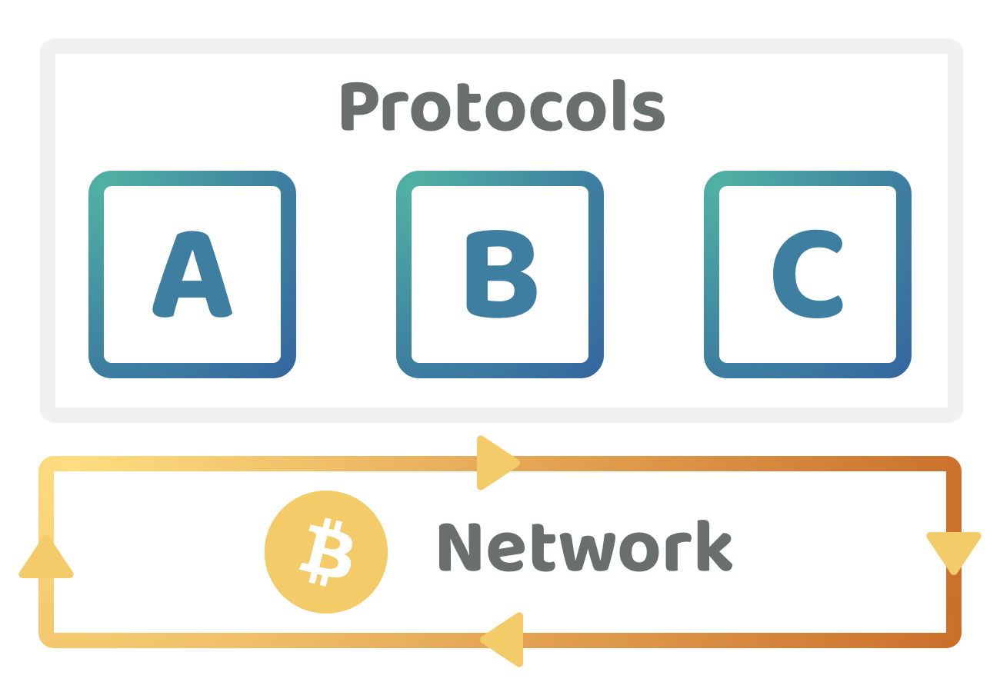

# Project token vs base network circular economies

<figure><figcaption></figcaption></figure>

Web3 ecosystems can have a range of different incentives that flow through the ecosystem. One comparison worth exploring is the difference between creating token based circular economies with project protocols and applications against creating a larger circular economy using the native coin used at the base of the network. Either of these approaches could be used to help fund the development of the ecosystems protocols and applications.

If the value of these different projects is captured in their own token there is the potential that the token itself could fund the ongoing maintenance and development efforts of the project due to the fees from the protocol or application. Alternatively the base network could also have a disbursement process from network fees that helps to support these protocols and applications during development. Either of these approaches can have a direct influence on the user behaviours and execution outcomes. One key question to answer is whether these adopted approaches in an ecosystem are effective or not for funding public goods such as open source software that the whole ecosystem could benefit from.

Comparisons can be made regarding the implications of applying the incentives in a single circular economy at the base network layer against having multiple circular economies within project protocols and applications that are building on top of that network.

## Circular economy token ideas

There are a number of software projects that could benefit from trying to create a circular economy through the usage of their own dedicated token. These same ideas could also function by using the network coin to accept fees meaning they would not need to use a token. Some ideas could also be suitable for being supported by the network's treasury. A list of non software related ideas have also been listed to help highlight other potential beneficiaries of incentives being made available from the network treasury.

**Software ideas**

The following ideas could create a circular economy with their own token, they could also charge fees with the networks base coin and also could have neither of these and be funded using network based incentives.

* Stablecoin's - e.g. USD token
* Security tokens - e.g. Bonds, stocks
* Real world asset tokens - e.g. Tokens that represent commodities or a house, car etc.
* Soulbound tokens - Tokens that are issued and designated to a single individual or entity and are not transferable.
* Privacy tokens - A token could wrap an existing coin from a public chain and make the transactions private.
* DeFi protocols - DEX, borrowing & lending, synthetics, derivatives, CDPs
* DAO, governance & identity tooling
* Utility software libraries - For building smart contracts, transaction builders etc
* Network infrastructure tools & libraries
* Security reviews & code audits
* Scalability solutions
* Indexers, explorers & data oracles
* Wallets

**Other non software ideas**

* Research & analysis
* Demos & onboarding
* Articles & blog posts
* Hackathons
* Contributor mentorship
* Community hubs
* Workshops & courses
* Ecosystem educational resources
* Translation support
* Standardisation efforts

## **Web2 protocols & software libraries**

Web3 ecosystems could develop a number of new protocols and software libraries that don’t require a token. These projects could be gradually improved and maintained over time. Listing some example Web2 protocols and software libraries helps to provide some evidence that utility and governance based tokens might not be necessary for a large number of projects in Web3 ecosystems.

**Network protocol examples**

* [HTTP](https://en.wikipedia.org/wiki/HTTP)
* [TCP/IP](https://en.wikipedia.org/wiki/Internet\_protocol\_suite)
* [FTP](https://www.notion.so/TODO-8dd367f2ad0a4ccca555e781fef1215c?pvs=21)
* [SMTP](https://en.wikipedia.org/wiki/Simple\_Mail\_Transfer\_Protocol)

**Software library examples**

* [Lodash](https://lodash.com/)
* [Express](https://expressjs.com/)
* [React](https://react.dev/)

**Advantages**

* **Faster integration** - Users of these protocols and software libraries can adopt them immediately and integrate them into their own solutions helping to speed up their own development efforts.
* **Modifiable** - Projects using these protocols and software libraries can take and modify the code to help with addressing any of their own specific use cases.
* **Self determined upgrades** - Users will self determine when they want to upgrade from one version to another. If they disagree with a certain change or don’t want to allocate the effort to making an upgrade they could remain on the same version.
* **Predictable** - Each version of these protocols and software libraries will usually come with a change log of what has changed since the last version. Documentation is also often available that outlines how the software works and how it can be used.
* **No required governance participation** - Anyone using these protocols and software does not need to be involved with how they are developed or be worried about some governance decision suddenly directly affecting them and the current version they are using. Users can let the contributors involved in improving those protocols and libraries handle what changes should be made based on community feedback. Contributors using this software can decide to adopt or not adopt any new releases. Teams looking to maximise their execution efficiency could often prefer to not be engaged in the oversight and governance of existing open source projects and instead prefer for that responsibility to be delegated to other professionals.
* **No need to purchase a token** - Anyone using these protocols or software can express their preferences and opinions in the forums, code repositories and other available communication channels about what could be improved or what opportunities might exist. No token needs to be purchased for them to participate and have some form of influence over the direction of these protocols and software libraries.

**Drawbacks**

* **Fundraising to pay for contribution efforts** - These protocols and software libraries can be highly complex and require highly specialised professionals to help with maintaining and improving them over time. Funding can often be problematic for some projects due to the fact that the protocols and software libraries themselves are open source and free to use meaning they are not a revenue generating business. Many of these projects are reliant on large sponsors, often from corporations but also from governments and individuals.
* E**xcessive sponsor influences** - The larger sponsors to these protocols and software libraries can more easily have a larger amount of influence on the development direction of these solutions due to their financial involvement. Projects can benefit from having higher amounts of sponsorship diversity to better protect and represent the interests of the entire user base for those protocols and software libraries.

**Key takeaways**

* **Tokens are often not necessary** - Tokens could introduce more complexities for people to use and integrate these existing protocols and software projects. If every protocol and software project added their own token the users of these solutions would then need to be concerned about the price of those tokens and how it impacts how they can use the solutions available and also be concerned with how token governance could impact their ongoing usage of these solutions. Utility tokens in some projects could end up introducing malicious actor complexity due to the risks that a small group of actors manages to get hold of a large amount of tokens to maliciously impact the usage or direction of a protocol.
* **Opportunity for addressing funding issues** - An opportunity for Web3 ecosystems is their ability to help solve the need for ongoing financial support for building and sustaining open source protocols and software libraries. These emerging Web3 ecosystems massively benefit from having a robust and thriving open source ecosystem that their entire user base can use. Making incentives available to build and maintain these protocols and libraries helps to achieve this outcome.

## Project token incentives

Web3 ecosystem projects could introduce a token to try and create their own circular economy around the idea they are developing. An example could be a DEX where the fees are charged in the project's token and then used to help pay for future development efforts.

<figure><figcaption></figcaption></figure>

**Advantages**

* **Autonomy** - A project integrating their own token has full autonomy to add and remove features and utility to their token and also increase or decrease the fees involved that generate revenue for the protocol or application.
* **Fundraising** - Introducing a token can be an effective tool for raising funds from a community. This can be a debatable advantage though as it can cause future problems if the community is purchasing a token and hoping it rises in value over time and the token ends up having limited utility. The project's idea and execution might be highly impactful but the solution might not require the addition of a token.
* **Utility** - A project's own token can be created and integrated into a number of unique use cases that are only relevant to that project. As an example, an online game could have a token that is used as an in-game currency and the token could inherit a number of different properties based on how long the user has had the tokens and how they are interacting with the game.
* **Governance** - A project could use a token for increasing the amount of community governance involved with product direction, resource allocations and future contribution efforts. This can be a debatable advantage as governance tokens could also centralise the power to certain actors and add attack vectors such as using flash loans to increase someone's influence in the short term over certain governance decisions.
* **Customisation** - The token can be customised to have any beneficial properties or information attached to the token itself to help with facilitating certain use cases.

**Drawbacks**

* **Public goods funding complexity** - If there is little to no base network incentives available the ecosystem projects that have their own treasury and token could end up becoming more important for supporting mutually beneficial public goods. There is an increased complexity for these projects to handle these requests as each of them would need to fairly determine how much they are going to support those initiatives. A single public goods initiative could result in having many governance decisions within many different project treasuries rather than a single decision from a network's treasury. The fundraising complexity has also now increased for the public goods initiative contributors as now they would need to request funding from many different projects rather than a single network treasury. The contributors would also now need to convince multiple projects that each have their own communities to now support their public goods initiative.
* **Misalignment with competing ideas** - If an existing ecosystem project has a dominant position with their own treasury and token there is an issue around the lack of incentives for that project to support smaller competing ideas if they aren’t able to capture any of the financial upside to that project's success. If that project is successful it could mean reducing the value of the larger projects token. Large projects could have a political influence with other projects in the ecosystem where some token holders in the larger project could also be token holders in other projects. This situation results in misaligned incentives to support an initiative that could be highly impactful for the ecosystem. Another incentive misalignment that can occur is when there are two competing projects that each have their own token and treasury. A complexity emerges for those projects in deciding whether to fund other public goods as doing so might give their competitors a financial advantage if one project supports those initiatives and the other doesn’t.
* **Ongoing execution efforts aren’t always necessary** - Some protocols and libraries do not need continuous execution efforts and instead can benefit from being developed in stages where after a period of time a new version gets developed and released based on recent feedback. Having periodic releases to add new features or fixes can be a fairly normal approach for many software projects as they often need to let the dust settle with their recently released version to enable sufficient time for feedback from the community to emerge on what problems exist and what opportunities could be addressed. Creating a circular economy could over stimulate the ongoing development of the same project so that demand or the token value can be increased. The project might benefit from more gradual and methodical releases and be more impactful if it enabled contributors to allocate their efforts on other highly impactful areas in the ecosystem.
* **Governance complexity** - Token based governance can increase the responsibility and complexity for community members to handle the direction and operation of a project. This might not be a good outcome for a project that is highly complex and that is more suited to delegating the responsibility to a group of professionals that have been actively working on the project. Contributors who work full time on a project will be the most well informed on how the project functions technically and what is feasible and pragmatic in terms of next steps. Another risk around governance based tokens is that malicious actors could emerge and try to use flash loans to suddenly secure a large enough amount of tokens to influence governance decisions. If the token governance decisions impact the parameters and usage of the protocol in any way this could mean creating an ongoing risk that users of the protocol will need to look out for.
* **Added usage complexity** - Adding a token that creates another circular economy can increase the complexity for people to use that protocol or application. Just using the base network coin could mean the user would only need to be concerned with that network's transaction fees or potentially not be concerned with a fee at all for many software libraries. However if a new token is added to these projects the user could now need to be concerned about the price of that token at the time of paying the fee, what influence that token has on the usage of that protocol and how other token holders could negatively influence their own usage or access to that protocol.
* **Uneven power distribution** - Some protocols and applications will grow larger than others which can lead to a growing divide between the value of their treasuries. This financial difference could translate to some projects having an increased influence over the wider ecosystem. The risk of centralised control and influence over the network is increased in this situation as you could have protocols that dominate the network in terms of usage and treasury value. Without any base network incentives the flow of incentives would be more heavily influenced by the large project token holders from these protocols. This lack of power distribution across the network could be even more problematic due to the misaligned and partially aligned incentives that these projects have to support different or competing initiatives.
* **Reduces contribution flexibility** - Introducing a token for a project is a large commitment for the contributors involved as they would then become responsible for making this token successful. Contributors would not be able to readily pivot their contribution efforts to other ideas and areas if it did not align with improving the existing project and token that they have already launched and are responsible for. Adding a token could limit how contributors generate impact for the ecosystem as now they have to try and make a return for their token holders. This focus might not be the most impactful outcome for the ecosystem that the contributors or project could be working on. Contributors could be left responsible for trying to create a sustainable circular economy in a project that wasn’t well suited to this outcome to begin with.

## Base network **incentives**

Base network incentives mean that any available funding is requested through the networks own treasury disbursement process. These treasuries could have been established due to a community allocation from genesis or could exist due to a circular economy where the ongoing transaction fees help to build up the treasury over time. Either a foundation or the coin holders of that ecosystem will often determine how that treasury is disbursed to support the most impactful initiatives in the ecosystem.

<figure><figcaption></figcaption></figure>

**Advantages**

* **Simple approach for funding public goods** - The most important public goods can be more easily funded from the base network incentives as the entire community can be more easily aligned on how those initiatives can benefit the entire ecosystem. Base network incentives provide an easier path for contributors to suggest and get funding for impactful initiatives and for that funding source to remain available over the long term. Many of these initiatives could help with growing and improving the network itself which can lead to a larger network with more funding available to support future public goods. With base network incentives the contributors would only need to apply for funding in one place rather than across scattered projects which are not responsible for the entire ecosystem and that each might have their own process. This simplicity in access to funding with base network incentives can help with saving contributors time.
* **Fully aligned incentives** - Incentives being disbursed from the base network treasury can be directed towards any high impact initiative that could generate impact for the ecosystem. It would only matter if that initiative could generate impact for the ecosystem and wouldn’t matter if that initiative competed with any existing solutions that are also being worked on. If less project tokens exist this also reduces the incentive for people to try and block these new suggested initiatives due to the incentives that emerge for people to protect the value of their own assets. Instead these initiatives would be more fully aligned with the incentives of the community that all want to improve the network and see the value of the network and networks coin increase over time. Large existing protocols would not have increased influence over funding competing solutions which can help create funding environments that are more effective at quickly supporting novel and interesting ideas that compete with existing protocols.
* **High contribution flexibility** - By not creating numerous separate tokens for each protocol the contributors involved with the execution of those protocols are no longer responsible for maintaining and increasing the price of a project's token. It now becomes much easier for contributors to help with one or many ideas and also to direct their contributions with initiatives that are able to generate the largest amount of impact. Contributors would be able to respond to how the ecosystem uses and adopts any ideas and adjust their contribution efforts accordingly to double down on the most popular and impactful ideas. This also helps to enable situations where it could be beneficial for development to be paused with one idea after a new version is released to enable time for feedback to come in before working on the next version. Those contributors could now more easily be supporting other software libraries and protocols before returning back to the original idea to help with a future version.
* **Reduced governance complexity** - Community members that use the protocol or software libraries created using the base network incentive would not need to purchase a token and vote to participate in governance. Instead they could offer their preferences and opinions about the project and vote on contributors they believe should be left with the responsibility of governing that project's planning and development efforts. Removing token based governance can also help with reducing the risks around a suddenly emerging group of malicious actors from capturing a large amount of tokens and voting in a malicious way that could be to the detriment of the existing users of the protocol or application.

**Drawbacks**

* **Reliance on base network incentives** - If an increasing amount of incentives are being made available through the disbursement process from the base network treasury there is a risk around the reliance the community has on this process. The disbursement process would need high levels of stability and be probably effective and timely in allocating resources towards impactful initiatives. An ecosystem’s disbursement process could become one of the most important reasons why an ecosystem thrives or stagnates over time.

## Key takeaways

**Many ideas do not need a token**

Many of the software and non software ideas that were previously listed above do not need to create a token with a circular economy. Adding a token to projects that do not have a sufficient justification to do so can increase the amount of governance and economic complexity involved in executing their idea and add personal burden to the contributors to maintain this token over time even in situations where it might not be an impactful initiative to work on anymore. Tokens can make contributors more responsible and attached to a single idea they are working on even though there might be other more impactful ideas they could have worked on to more effectively benefit the ecosystem.

**Base network incentives produce more fully aligned incentives**

Incentives that get disbursed from the network's treasury produce more fully aligned incentives to fully support initiatives that could generate impact for the ecosystem. The wider community can support initiatives that best support the network and produce the biggest chance of growing and improving the ecosystem. Base network incentives help to remove the misaligned and partially aligned incentive problems due to the removal of token holders from existing projects being incentivised to defend their own interests at the expense of what might be best for the wider ecosystem.

**Base network incentives help to increase contribution flexibility**

Using base network incentives helps to make coordination easier for executing a wide range of potentially impactful ideas. Contributors would not need to be tied to a single idea with sole responsibility to maintain and increase the value of a project's token. Instead contributors could align their efforts with identifying and contributing to the most promising and impactful ideas. Execution efforts can also start and stop at any time on a single idea when it might make sense to direct efforts elsewhere. Higher contribution flexibility can be most easily achieved by using a contributor focused disbursement process (delegated idea selection).
