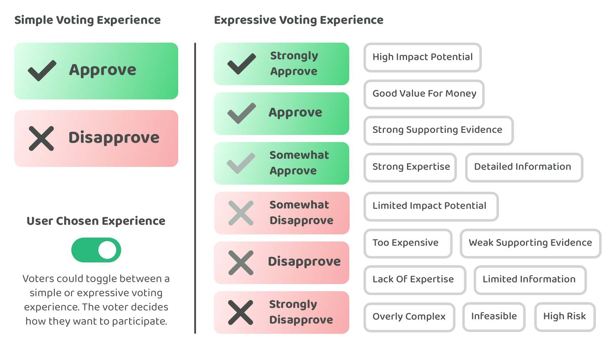

# Expressive approval voting with decision disapprovals

<figure><figcaption></figcaption></figure>

**Expressive approval voting with decision disapprovals**

Approval voting can be used for single selection decisions where one proposal can be approved and for multiple selection decisions where multiple proposals can be approved in a single decision. Approval voting can be extended to become expressive by introducing the disapproval option that is only informational and would not impact the decision outcome. Confidence variants can also be added to both approval and disapproval options so voters can indicate how confident they are with their decisions. A decision disapproval voting option could also be added for situations where voters disagree with some or all of the proposals in a decision and would prefer that the decision is abandoned or revisited in the future.

**Advantages of these voting approach suggestions**

* **Simple and quick for voters** - Binary voting and approval voting are very simple and quick for voters. This makes these approaches very suitable for large scale voting systems that want to handle a large number of voters.
* **High voter expressiveness** - Improving upon binary voting and approval voting by making them more expressive helps to make the decision process more informative and insightful. Voter preferences and opinions can be captured more effectively and quickly with this suggested approach and the data can help with improving the proposal quality and the ecosystems decision making ability over the long term.
* **Robust at scale** - Different voting behaviours would not give bad actors an added advantage with these suggested voting approaches. These suggested approaches would be robust and resilient at scale and could handle a large population of voters.
* **Universal voting solution** - The same voting option structure that has both approval and disapproval options with confidence variants can be used for nearly every decision that is made in a Web3 ecosystem. These suggested voting options work for binary decisions, single selection decisions and multiple selection decisions. A simple and universal solution can help with making it easier and quicker for voters to learn and participate in any voting decision being made across an ecosystem.
* **Custom voting experience** - The suggestion for making binary voting and approval voting more expressive is not one that needs to be forced upon the voters. The voter could be given either a simple voting experience or an expressive voting experience depending on their own preferences. A simple version could have an approval and disapproval option on every proposal and for every decision type. The more expressive version would enable voters to indicate the level of confidence they have in their approval and disapproval decisions and also enable them to provide more general feedback. Using a simple toggle setting could enable voters to decide themselves which voting experience they want to have. Some voters might prefer to vote as quickly and efficiently as possible with a simple voting setup. Other voters might prefer to express confidence in their decisions and provide more feedback.

**Expressive binary voting**

The suggested score voting approach is to allocate 1 point per proposal that voters can then use when approving a proposal. If the decision was a binary decision that had a single proposal with a yes or no outcome a single point allocation approach would simply mean that it is actually a binary voting system and not a score voting one. Expressive binary voting could be used alongside expressive approval voting to cover any binary voting decisions. Expressive approval voting helps to cover both single and multiple option selection decisions. The main difference between expressive binary voting and expressive approval voting is that the disapproval voting options would be counted towards the final decision with binary voting. Voting power is always applied to both approval and disapproval options with binary voting. Expressive approval voting would only apply the approval voting power to determine a final outcome.
