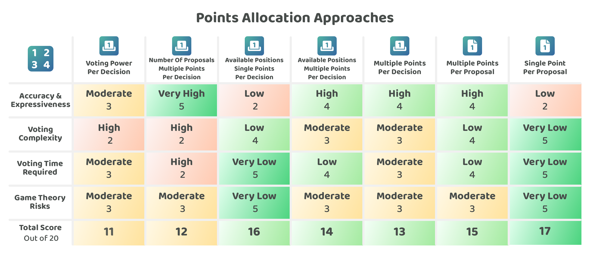

# Points allocation approaches

Voters could be given a varying amount of points to allocate to each proposal in a given decision. This number of points that voters can allocate will influence the expressiveness and accuracy of the decision process and can also impact the voting complexity and time required to participate.

Points could be used in a per decision or a per proposal allocation approach:

* **Per decision** - Voters distribute their allocated points across any of the proposals they prefer. For example, 100 points per decision means that a voter could allocate 100 points across any of the submitted proposals. If the number of allocated points was less than the total proposals submitted this would mean the voter would not be able to allocate a point to every proposal.
* **Per proposal** - Voters receive a number of points for every proposal. Voters can then allocate to the ones they prefer. For example, 100 points per proposal means that a voter could allocate from 0 to 100 points on any proposal.

**Per decision & per proposal main differences**

The main approach differences to consider when comparing per decision and per proposal allocation approaches are:

* **Per decision has higher accuracy** - Encourages more comparison and ranking between proposals. This is good for encouraging voters to compare proposals through how they allocate their points but comes at the cost of increasing the complexity and time required for voters to make an allocation decision due to the need to compare multiple proposals.
* **Per proposal has lower voter complexity and time required** - Voters can vote on the proposals they are interested in and score them independently without the need to do as much comparison. The number of points a voter allocates to each proposal could be the same across the proposals in a decision. It is quick and easy to learn this approach as the number of points to allocate is always the same for each proposal.

**Maximum proposal allocation approaches**

A maximum points allocation cap could be applied to proposals in the per decision allocation approaches. A fixed maximum points allocation was one of the simplest and more effective approaches for reducing game theory risks whilst allocating points across proposals in a decision. A fixed maximum points allocation approach will be used when comparing the per decision points allocation approaches.


[maximum-points-allocation-approaches](maximum-points-allocation-approaches/)


## Approaches for allocating points

A number of approaches exist that could be used to determine the total number of points a voter will get to allocate across each proposal in a decision:

* [**Voting power per decision**](voting-power-per-decision.md) - Points are allocated based on someone's voting power.
* [**Number of proposals multiple points per decision**](number-of-proposals-multiple-points-per-decision.md) - Points are allocated based on the number of proposals that have been submitted.
* [**Available positions single points per decision**](available-positions-single-points-per-decision.md) - A point is allocated for each available position that can be filled.
* [**Available positions multiple points per decision**](available-positions-multiple-points-per-decision.md) - Multiple points are allocated for each available position that can be filled.
* [**Multiple points per decision**](multiple-points-per-decision.md) - A fixed number of points are allocated to voters for each decision such as 100 or 1,000 points.
* [**Multiple points per proposal**](multiple-points-per-proposal.md) - A fixed number of points are allocated to voters for each proposal such as 5, 10 or 100 points per proposal.
* [**Single point per proposal**](single-point-per-proposal.md) - A single point is allocated to voters for each proposal.

To compare these points allocation approaches a number of [factors have been considered](./) and then applied to each approach to try and determine any strengths and weaknesses of each one.

<figure><figcaption></figcaption></figure>

**Key takeaways**

* **Voting power per decision adds voting experience differences and complexity** - The voting experience for each individual could change for every decision as their voting power changes and each voter would also receive a different voting experience as everyone would have a different amount of voting power. It could be simpler for the voter if a standardised amount of points is used for applying their voting power in a decision rather than using the voting power amount itself.
* **Number of proposals with multiple points per decision could become overly complex** - The number of proposals submitted could change drastically between decisions and result in a very different number of points for voters to allocate. This large number of points and level of expressiveness is likely not necessary in a decision with a large number of voters due to the added complexity and time it would take to allocate a changing amount of points in each decision. The number of proposals submitted will often not influence the amount of available positions that can be filled, meaning voters could often have a very large number of points to allocate but fewer available positions to fill.
* **Available positions add some execution complexity** - The number of available positions can’t always be known ahead of time. Proposals could be competing for an available pool of funding and each proposal could be requesting a different amount. In these cases the available positions would need to be estimated. This adds some complexity for the voter as they could be given an estimated number of points to allocate that changes for every decision they participate in. The outcome of a decision would actually decide how many positions are actually filled and this might not equate to the original estimated number of available positions.
* **Available positions single point is more straightforward though lacks expressiveness** - Voters only receive points for the estimated positions that need to be filled. This could be very restricting as the voter could have multiple proposals that want to support equally with their voting power. Voters wouldn’t be able to do this due to the limit in the number of points they can allocate. The benefit of this approach is it will be quicker for voters to participate as they won’t need to vote beyond the estimated number of positions that they need to allocate for.
* **Available positions with multiple points is more expressive but adds complexity** - If voters have multiple points for each available position they could spread those points across more proposals than there are positions. This approach is more expressive for the voter for indicating the intensity of their preferences. The complexity that is introduced however is that voters have an ever changing amount of points that they need to allocate in each decision that is also based on an estimate of what available positions can be filled. Bad actors could be given an advantage in situations where voters spread their votes too thin across multiple proposals as this would dilute their voting power influence over the decision.
* **Multiple points per decision is highly expressive and accurate but adds some voter complexities and game theory risks** - Having a large number of points to allocate across the submitted proposals is effective for giving voters a large amount of expressiveness and also for increasing the accuracy of the outcome as voters are forced to compare and decide which proposals will be allocated the most points. The issue with this approach is that the number of points might not be suitable for the ever changing amounts of proposals in each decision. It also has the same game theory risks as the other approaches in situations where points are spread too thin across many proposals.
* **Multiple points per proposal is expressive, simple and easy however this still has some game theory risks** - Having multiple points that can be allocated towards each proposal means that process is still expressive but might be less accurate if proposals don’t need to be compared when allocating points. The benefits of having a fixed number of points per proposal is it means that the process is more simple and straightforward for the voter to participate. The voters just need to indicate the intensity of their preference for each proposal. This approach has the same game theory issues as some of the other per decision approaches where voters could dilute their voting power using too few points on each proposal. This would give bad actors who always apply the maximum voting power an advantage over that type of voting behaviour.
* **Single point per proposal is not expressive but it is very simple and quick for voters and it also removes game theory risks** - Voters receive a point that they can allocate to each proposal. Voters would be able to vote on any proposals that they want to approve however they wouldn’t be able to indicate the intensity of their preference. This approach is not very expressive for voters. The main advantages of this approach are that it is simple and quick for voters to participate in a decision. It also removes game theory risks by not giving bad actors any extra advantage with their voting power as everyone would always use their full voting power regardless of their voting behaviour. This approach is one of the most effective for ecosystems that are looking to increase voter participation to a very large number of people due to its simplicity and effectiveness at preventing bad actors from getting an advantage from certain voting behaviours.

**Points allocation approaches analysis**


[maximum-points-allocation-approaches](maximum-points-allocation-approaches/)



[points-allocation-factors-for-consideration.md](points-allocation-factors-for-consideration.md)



[voting-power-per-decision.md](voting-power-per-decision.md)



[number-of-proposals-multiple-points-per-decision.md](number-of-proposals-multiple-points-per-decision.md)



[available-positions-single-points-per-decision.md](available-positions-single-points-per-decision.md)



[available-positions-multiple-points-per-decision.md](available-positions-multiple-points-per-decision.md)



[multiple-points-per-decision.md](multiple-points-per-decision.md)



[multiple-points-per-proposal.md](multiple-points-per-proposal.md)



[single-point-per-proposal.md](single-point-per-proposal.md)

