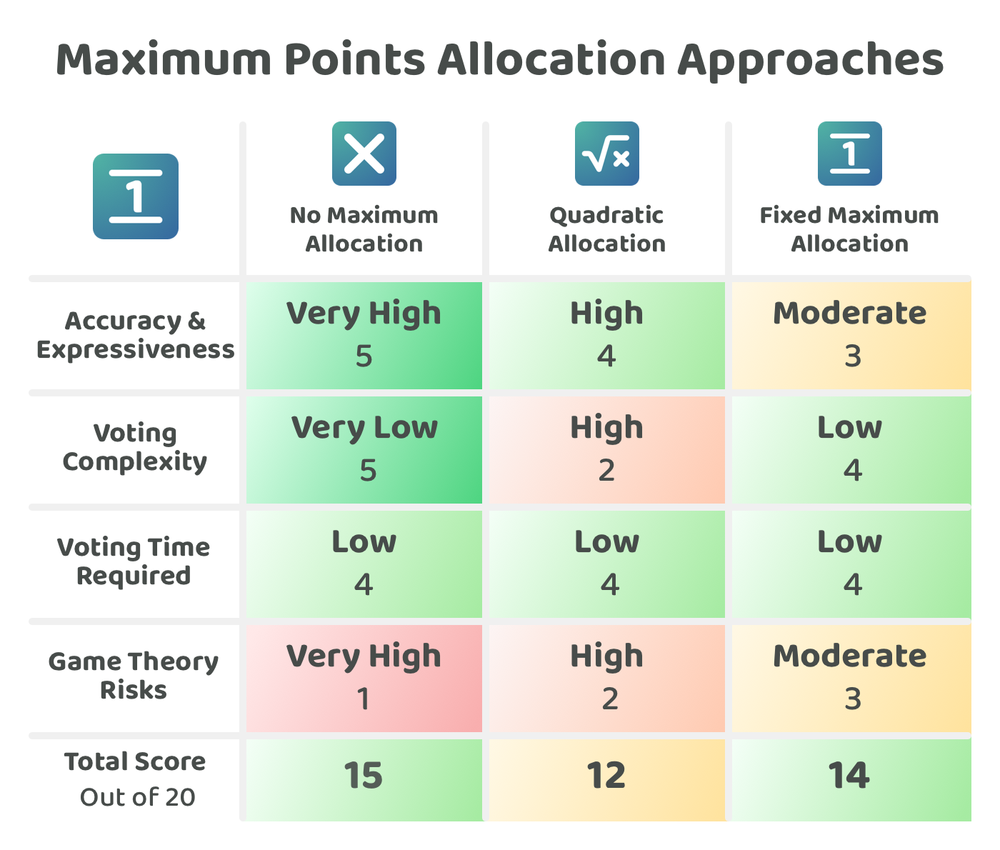

# Maximum points allocation approaches

Points can either be allocated per proposal, meaning that voters have the same amount of points to allocate with each proposal, or they can be allocated per decision, meaning voters receive a single set of points that they then allocate across all proposals. Per decision based points allocation approaches need to decide whether they are going to add a maximum number of points constraint on each proposal to limit the number of points that can be allocated to each one. Proposals that have no maximum points allocation cap can be a simple and quick approach for voters to understand however a lack of a maximum allocation can mean introducing a large amount of game theory risk where bad actors could increase their decision influence by not diluting their voting power across multiple proposals and only allocating their points towards one proposal. Some approaches that can help with reducing some of the game theory related risks are quadratic based allocations and fixed maximum allocations. These approaches each have their own impact on the expressiveness & accuracy of the voting process, the simplicity and speed in which voters can participate and the game theory risks that can still exist due to that maximum allocation approach.

## **Approaches for handling maximum points allocations**

The following are some approaches that could be used for allocating points across proposals in a single decision:

* [**No maximum allocation**](no-maximum-allocation.md) - Voters can allocate all their points on one proposal or across multiple proposals.
* [**Quadratic allocation**](quadratic-allocation.md) - The cost of allocating points increases quadratically when more points are allocated to the same proposal.
* [**Fixed maximum allocation** ](fixed-maximum-allocation.md)- Voters can allocate a maximum number of points per proposal.

To compare these points allocation approaches a [number of factors have been considered](maximum-proposal-allocation-factors-for-consideration.md) and then applied to each approach to try and determine any strengths and weaknesses of each one.

<figure><figcaption></figcaption></figure>

**Key takeaways**

* **No maximum allocation is simple and quick but gives bad actors a simple attacking strategy** - This is the most simple approach for voters as they can simply allocate their points exactly how they like. The problem with this approach is any dilution of points across multiple proposals would mean bad actors could be given an edge if they always consolidate their voting power on a single proposal.
* **Quadratic allocations reduce some game theory risk but also introduce complexity** - The impact of bad actors should be reduced with a quadratic allocation approach however if normal voters consolidate their points or spread them out too thin there could be opportunities that emerge for bad actors to exploit those behaviours with their own voting strategy. Quadratic allocations also give voters this ongoing complexity of considering how they want to allocate their points and how their voting power can be diminished based on any increased allocation of points on a single proposal. Voting power is diminished for voters that want to express any intensity of preference.
* **Fixed maximum allocations help to reduce game theory risks but can limit a voter's expressiveness -** This approach reduces voter expressiveness as voters can’t easily indicate the intensity of their preference beyond the maximum allocation limit. Voters would be encouraged to hit those maximum points limits on any proposals they want to support. This approach reduces the impact of overly consolidated points from bad actors as now they would need to spread their points over multiple proposals. This approach still faces the risks around situations where voters spread their points too thinly across many proposals as this would give bad actors an increased influence by consolidating their points. Fixed maximum allocations are a simpler approach for voters to understand and also help to slightly further reduce the game theory risks over a quadratic approach. Fixed maximum allocations are a suitable approach for voting systems that need to be scaled to a very large user base due to the need for maximum simplicity and stability.

**Maximum proposal allocation approaches analysis**


[maximum-proposal-allocation-factors-for-consideration.md](maximum-proposal-allocation-factors-for-consideration.md)



[no-maximum-allocation.md](no-maximum-allocation.md)



[quadratic-allocation.md](quadratic-allocation.md)



[fixed-maximum-allocation.md](fixed-maximum-allocation.md)

