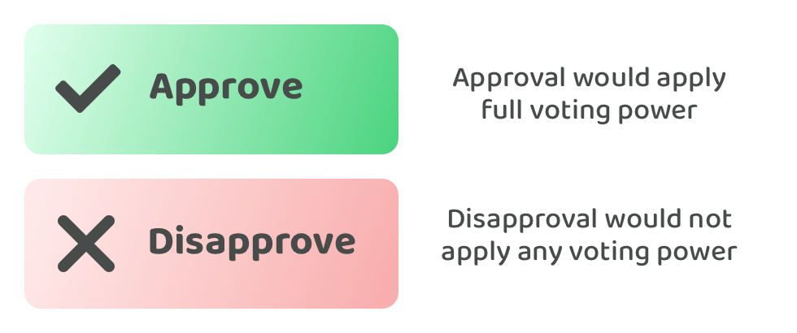
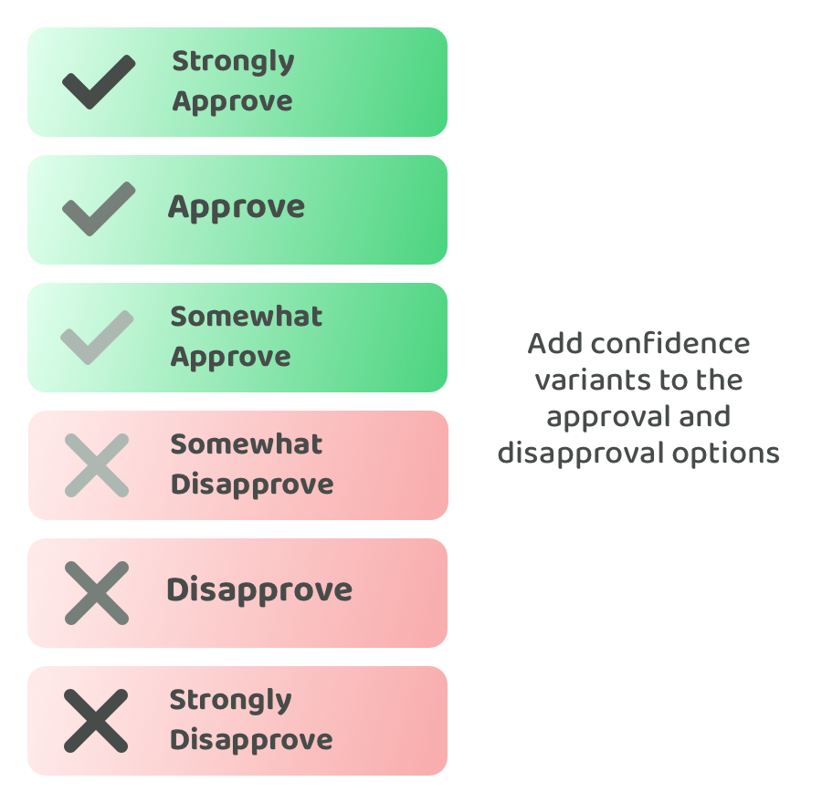
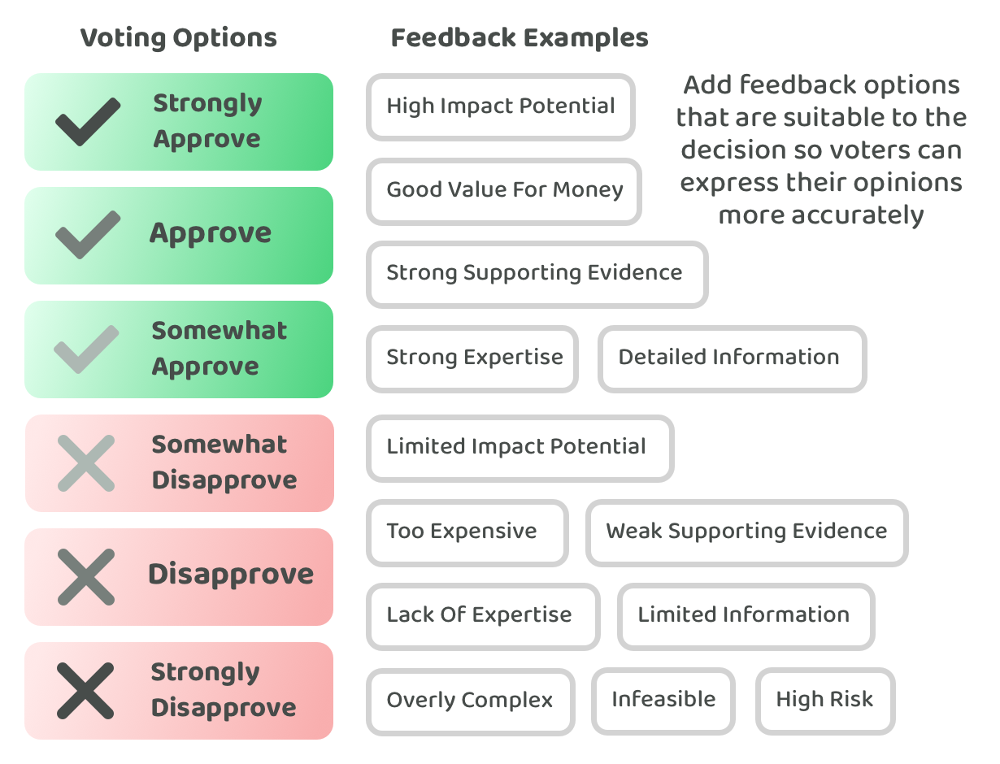

# Voting approach improvement ideas

The suggested approaches that emerged from the score voting approaches comparisons could be improved by adding in a way for voters to indicate a dissenting opinion and also to improve the expressiveness of approval voting.

## **Mass proposal downvoting**

Adding in downvotes is problematic for per proposal scoring as bad actors can simply downvote all competing proposals. This can give bad actors an edge over normal voting behaviour. Due to this attaching voting power to per proposal downvotes is not a game theory safe approach. An alternative way that voting power could be attached to a dissenting vote is by using a mass proposal downvote option. If a voter disapproves of the decision or most or all of the proposals they could decide to downvote every proposal instead of approving any of them. This could be useful in situations where the voter disagrees with the importance of the decision or believes that the quality of proposals submitted is not high enough. These are valid reasons why voters might prefer that a decision be disapproved entirely. An ecosystem could choose to abandon a decision that gets disapproved or they could decide to carry out another vote again in the future with improved or newly submitted proposals. The threshold for a mass disapproval option to succeed could be that the largest amount of voting power needs to agree with the disapproval when compared to the voting power applied to other proposals. Alternatively the threshold could be higher by requiring it to reach a certain percentage or over a 50% majority.

**Minimal game theory risks**

The main advantage of this suggested downvote option is that bad actors would have to downvote their own proposals if they wanted to vote with a dissenting opinion. The disapproval of all proposals would only succeed if a certain threshold of voting power agreed with this outcome. Bad actors could try to dissent all decisions to just be malicious however they could also do this type of behaviour by voting on poor proposals to just be malicious. The benefit of the downvote option is it shouldn’t directly give bad actors any more wealth or influence over the network in future decisions.

## **Expressive voting**

**Adding a disapproval option**

The main problem with adding a disapproval option with a per proposal points allocation approach is that bad actors can downvote every proposal that isn’t their own. This gives them a voting power edge as they get to use it both positively for their own proposals and negatively towards everyone else. The disapproval voting option could be added as a voting option however the disapprove option could have no impact on the final decision outcome. This turns the disapprove option into an informational tool for voters to express their disapproval of a proposal. This would make the voting process more expressive for voters as now they can share their dissenting views on a proposal that other voters can take into account in future decisions when the decision results are released.

<figure><figcaption></figcaption></figure>

**Approval & disapproval confidence variants**

Another problem with the initially suggested 1 point per proposal approach is it lacks expressiveness for voters to share the intensity of their preferences. One way this could be resolved is by giving voters some more confidence variants that they can choose from. These alternative options would generate the same outcome in terms of the amount of voting power that someone is applying to a proposal. The key difference is that the voter can express the level of confidence they have in their decision. For example an approval option could be split into three options such as “Strongly Approve”, “Approve” and “Somewhat Approve”. Selecting any of these options would mean a voter is applying their full voting power to approve that proposal. This could also be applied to the disapproval option mentioned above and result in “Somewhat Disapproval”, “Disapprove” and “Strongly Disapprove” options. Alternatively you could also just have a two variant option such as “Approve” and “Strongly Approve”.

<figure><figcaption></figcaption></figure>

**Optional common feedback options**

Another way that the voting process could become even more expressive beyond adding approval and disapproval voting options and confidence variants is to capture more feedback from the voters. This feedback would be entirely optional. After a voter has approved or disapproved a proposal they could also optionally express some rationale as to why they made that decision. Not every voter will be interested in giving this feedback however for the ones that are interested in doing so this could generate highly insightful information.

Some common approval based feedback examples could include:

* High Impact Potential
* Good Value For Money
* Strong Supporting Evidence
* Strong Expertise
* Detailed Information

Some disapproval options that a voter could select include:

* Limited Impact Potential
* Too Expensive
* Weak Supporting Evidence
* Lack Of Expertise
* Limited information
* Overly complex
* Infeasible
* High Risk

Each decision should consider what its own set of common reasons should be that might be relevant for why a voter decides to vote one way or another. Listing these out can make it quick and easy for voters to express their opinions when casting their vote. This type of information could be highly valuable to proposers as they could then more easily identify areas for improvement and reasons why other proposals might have been more successful. Another additional feature which could be useful is if voters could share their own specific feedback in a text box by using another option such as “Other”.

<figure><figcaption></figcaption></figure>

**Reducing negative information game theory risks**

Adding a disapproval option that doesn’t impact the decision outcome can be an effective way to prevent the negative influence of bad actors always downvoting competing proposals. Even with the voting power removed, bad actors might still decide to use the disapproval option to try and make proposals look bad in the results. They might do this to try and reduce the chance that similar proposals get selected in future decisions. One way this problem could be reduced is by making voting behaviours public without revealing the voting power or wallet addresses that made those votes. If an ecosystem is able to see that a voter has upvoted one proposal and downvoted all the other proposals there would be an immediate reason to be suspicious of this voter. These voting behaviours are more clearly trying to make other proposals look bad in the decision outcome data. Making this data public would make it much easier to identify trends in how people are using the disapproval voting option and which voters might be being more malicious rather than constructive. This could help with making it more difficult for bad actors to disapprove many proposals in a single decision without revealing that their anonymous voting behaviour was not done in a supportive and constructive manner. One main concern with this suggestion is thinking about how many voters might be needed to ensure that the privacy of voters is respected. People might be able to apply logical deduction to try and work out who is voting in a certain way if there weren't enough other voters. The larger the number of voters the less this factor should be an issue due to the larger number and variations of voting behaviour that should emerge from the decision data.
