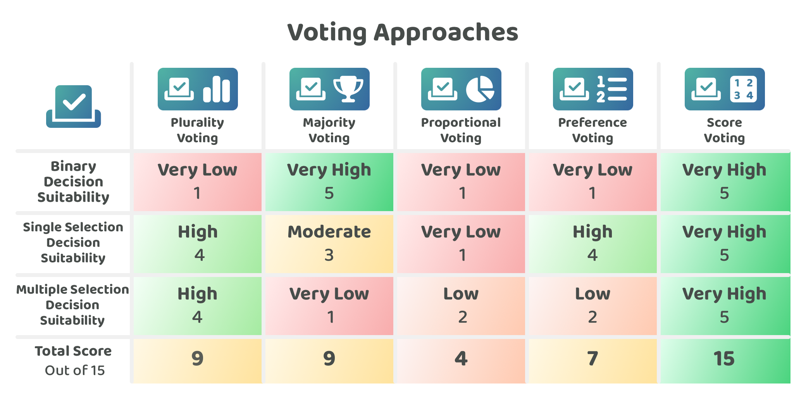

# Voting approaches

The voting approaches that are adopted in Web3 ecosystems will impact the level of accuracy and expressiveness that can be achieved using that voting system. Voters will often want voting systems that enable them to easily express their preferences and opinions. The adopted voting approach could also impact the total time it takes for voters to participate and the amount of complexity there is for making decisions. This analysis is mostly concerned with what voting approaches could be the most suitable for globally adopted Web3 networks. The larger a network becomes the more important it is to keep governance systems as simple as possible. Globally adopted networks have a high cost for voter participation and more risks around poor decision making due to the potential complexity of the voting process.

**Execution and scalability considerations**

Every voting process that is mentioned can be developed on-chain and integrated into a network's infrastructure and on-chain governance process. Due to this no comparison will be made about which approach is better based on execution complexity as all of these voting approaches could be developed as on-chain voting systems. In comparison, voting power is where execution complexity can vary drastically between the different approaches and analysis was more beneficial for the voting power approaches comparison.

## **Voting approaches**

The following are some example voting approaches that cover different categories of voting systems. It should be noted that some of these voting approaches can overlap with other categories. These voting approaches could be used for a range of different decisions that are made in Web3 ecosystems:

* [Plurality voting](plurality-voting.md) - The proposal with the most votes wins, regardless of whether they achieve a majority.
* [Majority voting](majority-voting.md) - A proposal must receive a majority of the votes, either through an initial vote or a subsequent voting process.
* [Proportional voting](proportional-voting.md) - The outcome from the vote is allocated based on the proportional number of votes that each proposal receives.
* [Preference voting](preference-voting.md) - Preference based voting systems allow voters to rank proposals in order of their preference rather than selecting just one proposal.
* [Score voting](score-voting.md) - Score based voting systems allow voters to express the intensity of their preferences by assigning a score to each proposal.

To compare these decision approaches a number of [factors have been considered](voting-factors-for-consideration.md) and then applied to each approach to try and determine any strengths and weaknesses of each one.

<figure><figcaption></figcaption></figure>

**Key takeaways**

* **Plurality voting is simple and could be useful for multiple option decisions** - Voters simply select the proposals they prefer with a plurality voting approach. This is simple and could be effective for some decisions. The main advantage of this approach is its simplicity though a key drawback with this approach is it lacks expressiveness by not capturing the intensity of someone's preferences.
* **Majority voting is useful for binary decisions but gets less effective the more voting options there are and the larger the number of selected proposals** - Binary decisions are inherently a simple decision process that achieve a majority outcome. This voting approach is great for less complex decisions where a majority outcome can be expected and required. When the number of voting options increases the difficulty in achieving a majority outcome can also increase with it. Increasing the number of proposals that can be selected can also mean increasing the challenge of expecting all of those proposals to reach a majority. For multiple selection decisions it will be difficult to expect voters to read and understand every single proposal so that a majority decision can be achieved.
* **Proportional voting is mainly useful for more specific decisions** - Most of the example decision use cases listed for Web3 ecosystems were not highly suitable for a proportional voting approach that is trying to create proportional outcomes. Certain situations such as group based contributor or delegated representative selection could be suitable however this approach can lead to more centralised decision making within those groups.
* **Preference voting can be effective for decisions with a limited number of voting options** - Ranking proposals can be a highly effective way to maximise the accuracy of a decision process to identify the most preferred proposal. This could make sense in situations where the number of voting options is limited and the complexity in comparing the voting choices isn’t too high. Single selection decisions where a single winning outcome needs to be achieved is where preference based voting might be the most suitable.
* **Score voting can be highly expressive and effective for every decision type** - Score based voting systems could be used across any of the decision types that have been compared. The key advantages with score based voting systems is that they enable voters to be highly expressive when sharing the intensity of their preferences to different voting options. This intensity of preference can even be useful in binary decisions so voters are able to express exactly how they feel about a proposal rather than a simple yes or no voting process. The main concerns to keep in mind with score based voting process is ensuring that it is simple for voters to understand the scoring system as allocating scores can be slightly more complex than a simple plurality approach. The opportunity with score based approaches is that they could be highly effective for every decision type and due to this could mean a similar approach could be adopted across a Web3 ecosystem. Fewer voting approaches could help with making it easier and faster for voters to understand and participate in ecosystem governance.

**Voting approaches analysis**


[voting-factors-for-consideration.md](voting-factors-for-consideration.md)



[plurality-voting.md](plurality-voting.md)



[majority-voting.md](majority-voting.md)



[proportional-voting.md](proportional-voting.md)



[preference-voting.md](preference-voting.md)



[score-voting.md](score-voting.md)

