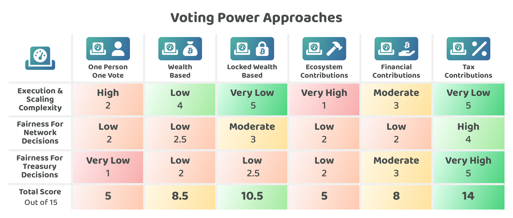

# Voting power approaches

The amount of voting power each person has will determine how much influence they have over the decisions to change network parameters and the decisions around how the ecosystems treasury should be used. The voting power approach will influence how easy it is to execute and scale the voting system and will also impact how fair the voting process is for the users of that network.

**Differences between Web3 ecosystems and nation state currencies & governance systems**

There are some important differences that Web3 ecosystems have with existing nation states that should be considered when thinking about what voting power approaches will be suitable:

* **Easy to switch** - People can immediately sell their assets and move to another Web3 ecosystem in a very short period of time. In contrast people that live in a nation state need to abide by the governance rules in that country and pay taxes in the national currency. To switch to another country's system a resident would need to move to another country. In Web3 ecosystems the user currently has many choices and can easily move between them at a moment's notice. This difference heightens the importance that these ecosystems treat them fairly as people can easily move to the network that they prefer and that provides them the most value.
* **Low commitment** - People do not need to have any commitment to a Web3 ecosystem and are not obligated to stay in one ecosystem over another. In contrast, residents of nation states are obligated to adopt the laws of that country and would often struggle to avoid the national currency. This is an important difference with Web3 ecosystems as it means no one is subjecting a person to use a Web3 ecosystem, it is entirely out of self choice. There is no obligation to continue using that network if they disagree with any of its parameters or approaches it adopts. This again increases the importance that ecosystems treat users fairly as otherwise these people would simply look for other ecosystems that do treat them fairly.
* **Personal preferences & values** - People could choose an ecosystem based on their own preferences and values. This is not common for existing nation state governments that instead often have a single currency and a single set of rules and policies in how the population have chosen to govern the nation. People can more easily pick one or multiple Web3 ecosystems that are more aligned with their preferences and values.

**Delegated voting power**

Any of the voting power approaches mentioned below could have delegated voting systems introduced that enable a voter to delegate their voting power to other individuals. This is a highly useful feature for voters as it enables them to spend their time voting on areas they care about or areas where they are most well informed. For decisions that they are less interested in or have less expertise they would then be able to delegate their voting power to someone they would prefer to make that decision with their voting power.

**Applying mathematical formulas & transformations**

Any of these voting power approaches could transform the voting power by applying different mathematical functions to achieve a certain outcome. One approach that has been growing in popularity is the usage of quadratic voting where the cost of incremental votes on the same option increases quadratically. This approach and other formulas can be effective for reducing the influence of whales when wealth based voting power approaches are being used.

**Dynamically changing voting power**

For many voting power approaches the amount of voting power someone has could dynamically change as different variables and factors change over time. For wealth based voting power approaches this is a concern in situations where people are able to access a quick loan to increase their immediate voting power to swing a voting decision and then quickly repay that loan immediately afterwards. Voting systems will need to consider how voting power approaches could be abused or gamed and identify preventative measures that increase the difficulty for abusing or gaming the voting system.

## **Voting power approaches**

The following are some example approaches that cover how voting power could be calculated and distributed between voters when making network or treasury decisions:

* [One person one vote](one-person-one-vote.md) - Equal voting power is distributed to each person on the network. Each voting wallet would need to prove that they are a human.
* [Wealth based](wealth-based.md) - Voting power is determined based on the amount of wealth that a voter has.
* [Locked wealth based](locked-wealth-based.md) - Voting power is determined based on the amount of locked wealth the voter has. This could be staked or locked coins.
* [Ecosystem contributions](ecosystem-contributions.md) - Voter power is determined by the amount of contributions that someone has made to the ecosystem.
* [Financial contributions](financial-contributions.md) - Voting power is determined based on someone's financial contributions towards a voting option.
* [Tax contributions](tax-contributions.md) - Voting power is determined based on the amount of tax a person has contributed to the network.

To compare these decision approaches a number of [factors have been considered](voting-power-factors-for-consideration.md) and then applied to each approach to try and determine any strengths and weaknesses of each one.

<figure><figcaption></figcaption></figure>

**Other notable approaches**

* **Age of wealth -** Holding a network coin over a long period of time could be one sign of commitment and support towards an ecosystem. This factor could be considered in addition to a wealth based voting power approach by factoring in how long someone has had their capital invested in the ecosystem.
* **Expertise & skill based** - The skills and expertise that someone has when contributing to an ecosystem can be highly valuable for maintaining and improving a network. An approach focused on the amount of expertise and skill people have would likely not be very effective for being the predominant voting power approach for either the network or treasury based decisions due to it only focussing on a subset of the community who contributes. It also is very difficult to accurately assess each person's skills and expertise and then fairly allocate an amount of voting power to each person. This approach could be useful as a supplementary approach for certain decisions. Delegation of voting power could be seen as a form of expertise and skill based voting power as voters would select the representatives they are most aligned with and that they believe are the most competent at making decisions by applying their own knowledge and expertise.
* **Reputation based** - Usage of the network and other forms of contributions could contribute towards a reputation score that is used as a form of voting power. Similar to ecosystem contributions it is difficult to capture and measure all of the different forms of usage and contribution that could be considered useful for the ecosystem and then quantify this into an accurate voting power score. It might not be effective or fair as a predominant way to distribute voting power however it could still be a potentially useful approach to combine with other more stable and suitable voting power approaches to encourage or reward certain usage behaviours that are beneficial to the ecosystem.

**Key takeaways**

* **One person one vote isn’t inherently fair for Web3 ecosystems** - People are able to easily move to other ecosystems at any point in time and no one is forcing someone to use a given Web3 ecosystem. This factor is important for Web3 ecosystems as this means it makes little sense to give everyone equal voting power. Instead it makes more sense to give people voting power based on the contributions they have made to the ecosystem that are aligned with the immediate and long term sustainability and success of the network.
* **Wealth based approaches are a good starting point but are not fair over the long term** - In the short term a wealth based approach can make sense for changing network parameters and allocating genesis treasury allocations. Over the long term this approach makes less sense as it gives wealthy individuals perpetual control and influence over the network. Tax contributions become the most important contribution to the network for it to survive and grow. Wealth based voting power has an ongoing but decreasing importance for network parameter decisions and a decreasing importance for treasury funding decisions over time.
* **Ecosystem contributions are not fair and are highly complex to execute** **-** Recording and measuring ecosystem contributions is extremely difficult and likely requires a moderation process with many checks and balances. Due to this it is unsuitable as a predominant voting power approach for most Web3 ecosystems. Elements of this approach could be considered in combination with other more stable approaches over the long term to achieve specific outcomes.
* **Financial contributions could be unreliable and are the most unfair to the most giving individuals** - No individual is obligated to help with funding ecosystem initiatives that help to maintain and improve the network. This approach can increase the risk of stagnation for the ecosystem if it is unable to compensate for impactful contribution efforts. The people who contribute the most to support the ecosystem are disadvantaged with this approach by the people who contribute nothing financially but then receive all the benefit from the initiatives that do get funded by people that contribute.
* **Tax contributions is one of the most aligned and fair long term voting power approaches** - Over the long term the most important contribution to the network's survival is ongoing transaction fees that pay for the validators. These same contributions could also help with funding an ecosystem treasury that helps to maintain and improve the network over the long term. It is fair for the people that contribute towards this treasury to have a proportional say in how their tax contributions are spent.
* **Voting power approaches should ideally be combined to take into account multiple contribution factors** - Wealth based approaches make sense in the short term and are likely a part of a long term solution for network parameter decisions. Tax contributions based voting power is likely the most increasingly important approach over the long term. A hybrid approach would likely make sense that takes into account both wealth and tax contributions for both network and treasury decisions. Tax contributions could become one of the main approaches for treasury decisions over the long term as this would just mean the people that contribute to the network's treasury would have voting power to influence how that funding gets spent. One person one vote and both the financial and ecosystem contribution approaches could all be considered as supplementary approaches for certain decisions in addition to the suggested hybrid voting power system.
* **Voting power approaches likely need to respond to market adoption** - The final outcome of what voting power approach is both fair and effective will be based on how the market evolves over time and the preferences of the users within each ecosystem. If the market consolidates to a handful of networks it will be more important to consider voting power approaches such as one person one vote as people might not have another alternative they can move to. If the market is more competitive over the long term and has multiple ecosystems being used across the world then the relevance of one person one vote would be reduced as no one is forcing a person to adopt one system over another.
