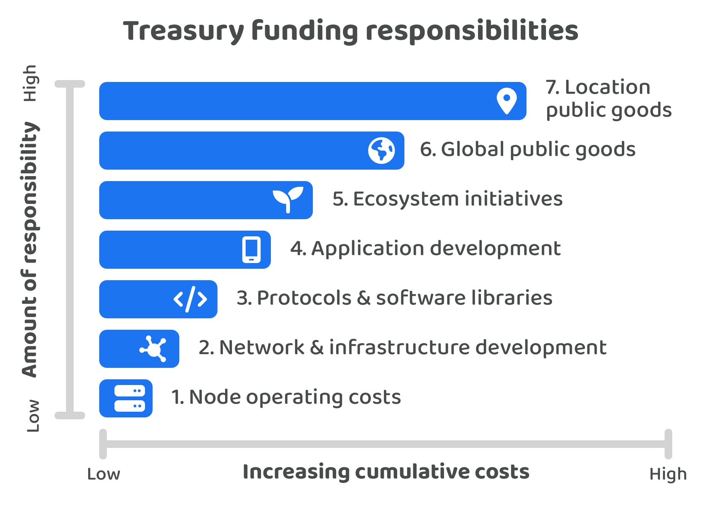

# Funding responsibilities

A Web3 ecosystem treasury could be responsible for funding a wide range of initiatives that benefit the ecosystem and wider society. Some ecosystems might choose to have no treasury responsibilities and fees that are collected by the network are only used to pay for the node operator costs. Other ecosystems might decide that their treasury can help with supporting a wide range of initiatives that could help to improve and grow the ecosystem.

<figure><figcaption></figcaption></figure>

**Incremental funding responsibilities**

1. **Node operating costs** - Network fees only pay for node operating costs. No treasury assets exist meaning the treasury has no funding responsibilities.
2. **Network & infrastructure development** - Research, maintenance and development of the network and infrastructure. This could include efforts around node development, consensus design, cryptography, transaction and ledger design, networking and peer to peer infrastructure and any smart contract language or SDK improvements.
3. **Protocols & software libraries** - Protocols that use the networks infrastructure and software libraries that improve the developer ecosystem. This could include initiatives such as utility libraries for transaction building and querying, identity and governance tools and solutions or libraries that make smart contract development easier. Initiatives could also include data oracles, indexers, interoperability and scalability solutions.  Any protocols that could be built on the network could also be included such as a storage, communication or logistics based protocols to name just a few examples.
4. **Application development** - Applications that utilise the networks available protocols and that can enable new use cases for the community to use. Applications could focus on financial, communication, social, gaming, governance or travel solutions to name just a few examples.
5. **Ecosystem initiatives** - Initiatives that could benefit the ecosystem such as events, education & onboarding resources, mentoring efforts, media content or public outreach.
6. **Global public goods** - Initiatives that can benefit people from across the world such as scientific, technical and medical research or open source software that may not be built on or using the ecosystems network.
7. **Location public goods** - Initiatives that are focussed on geographic locations such as those that support nature, wildlife, water & air quality, roads and public infrastructure.

Web3 ecosystems could include or exclude any items from this list of suggestions based on their own preferences and needs. The start of the list represents Web3 ecosystems that decide to have a treasury with very little responsibility. Each item going down the list increases the amount of responsibility that a Web3 ecosystem treasury could support through their own disbursement processes.

The list is roughly ordered based on the proximity the initiatives have with the network itself. Global and location based public goods for instance start to move beyond the needs of the ecosystem itself and mean that initiatives are being supported that benefit the wider community and society.
