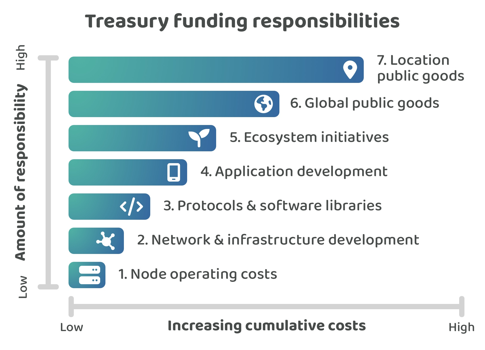

# Funding responsibilities

A Web3 ecosystem treasury could be responsible for funding a wide range of initiatives that benefit the ecosystem or wider society. Some ecosystems might choose to have no treasury responsibilities where fees that get collected by the network would only be used to pay for the node operator costs. Other ecosystems might decide that their treasury should have a number of responsibilities and look to fund a wide range of initiatives that could help with improving and growing the ecosystem.

<figure><figcaption></figcaption></figure>

**Incremental funding responsibilities**

1. **Node operating costs** - Network fees only pay for node operating costs. No treasury assets exist meaning the treasury has no funding responsibilities.
2. **Network & infrastructure development** - Research, maintenance and development of the network and infrastructure. This could include efforts around node development, consensus design, cryptography, transaction and ledger state design, networking and peer to peer infrastructure and any smart contract language or SDK improvements.
3. **Protocols & software libraries** - Protocols that use the networks infrastructure and software libraries that improve the developer ecosystem. This could include initiatives such as utility libraries for transaction building and querying, identity and governance tools or solutions or libraries that make smart contract development easier. Some other initiatives could be data oracles, indexers, interoperability and scalability solutions.  Any protocols that could be built on the network could also be included such as a storage, communication or logistics based protocols.
4. **Application development** - Applications that utilise the networks available protocols and that can enable new use cases that the community can use. Example applications could be those that focus on finance, communication, social, gaming, governance or travel solutions to name just a few potential use cases.
5. **Ecosystem initiatives** - Initiatives that could benefit the ecosystem such as events, education & onboarding resources, mentoring efforts, media content or public outreach.
6. **Global public goods** - Initiatives that can benefit people from across the world such as scientific, technical and medical research or open source software that may not be built on or using the ecosystems network.
7. **Location public goods** - Initiatives that are focussed on geographic locations such as those that support nature, wildlife, water & air quality, roads and public infrastructure as just some examples.&#x20;

Web3 ecosystems could include or exclude any responsibilities from this list of suggestions based on their own preferences and needs. The beginning of this list represents Web3 ecosystems that decide to have a treasury with very few responsibilities. Each focus area going down the list increases the amount of responsibility that a Web3 ecosystem treasury could decide to support through their own funding processes.

The list is roughly ordered based on the proximity the initiatives have with the network itself. Global and location based public goods start to move beyond the needs of the ecosystem itself and focus on initiatives that benefit the wider community and society.
