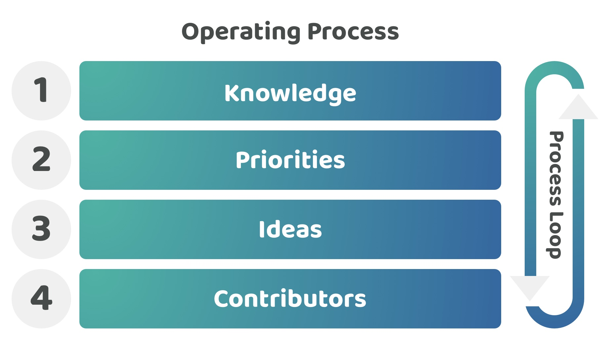

# Operating process

Web3 ecosystems need be well operated and constantly improved to remain competitive in a fast changing environment where new technologies, consumer preferences and approaches continue to emerge that can influence how these networks can be most effectively scaled, operated and used.

To better think about how a treasury could be operated and improved we can outline a general purpose operating process. This operating process suggests a simple four step process that can be repeatedly used over and over again when operating or improving an ecosystem. Any ecosystem could apply this process when thinking about how they are operating and improving their systems and processes.

How effectively an ecosystem is able to repeatedly move through this operating process will influence the quality of the outcomes they are able to produce. We can also explore how this process currently applies to existing ecosystems such as nation states or corporations to better compare how these different ecosystems operate compared to Web3 ecosystems. This comparison can then help with better identifying what problems and opportunities might exist for improving Web3 treasury systems and processes.

<figure><figcaption></figcaption></figure>

**1. Knowledge**

The first step of this process is to bring together any required knowledge about the area of focus. Knowledge will be the accumulation of any relevant information around the selected topic area. This could range from research, data, insights, analysis, cultural factors or personal experiences. Decisions and contributions made towards any ecosystem will be highly influenced by the knowledge people have about an ecosystem and that focus area. Knowledge could be explicitly documented and stated within these ecosystems however it also may not be stored online or publicly at all. In some instances it could simply be a shared pool of knowledge that is only currently captured in the minds of the individuals involved.

**2. Priorities**

The second step looks to apply this knowledge to help with the creation of priorities along with a decision on which of these priorities are the most important for the ecosystem at that given moment in time to address certain problems or opportunities. An ecosystem that has a certain mission or purpose will need to prioritise where they allocate their limited capacity and resources. Priorities will emerge from the shared knowledge of the individuals involved in the ecosystem. High quality knowledge about the area of focus will be vital for creating the right priorities that can achieve the desired outcomes. Changing knowledge such as any new emerging data, insights, research and analysis, cultural changes or technical advantages could all be potential influencing reasons for why priorities need to change suddenly or gradually over time.

**3. Ideas**

The third step focusses on generating ideas for how the selected priorities could be addressed. This is then followed by the selection of the ideas which appear to be the most promising. Individuals within an ecosystem can each have a number of ideas about how the current priorities could be addressed. Ideas will help with articulating how a potential solution or approach could help an ecosystem address their priorities and achieve any longer term goals. New ideas will emerge and existing ones may need to be updated once the available knowledge or priorities begin to change over time. Any number of the ideas that emerge within an ecosystem could be executed to try and address the current priorities. An ecosystem will usually have limited resources, meaning they will need to target and select the most promising ideas to execute so that the most important priorities can be effectively addressed.

**4. Execution**

The final step is to execute the selected ideas and then measure any resulting outcome. Measuring the outcome will be important for determining whether any of the priorities are being addressed before the ecosystem then repeats another loop of this same operating process again. The execution of any idea will require contributors to have the right skills and competencies to take an idea through to completion. The measured outcomes from these contribution efforts will create more data, insights and analysis which is then fed back into this recurring operating process in the form of more knowledge for future consideration.

**This operating process can be applied to any nation state, corporation or Web3 ecosystem**

Nation states, corporations and Web3 ecosystems will repeatedly loop through this general purpose process when operating and improving their own ecosystems. The better an ecosystem is at going through this operating process loop the more accurate and effective their efforts should become on generating the desired outcomes.

A general purpose operating process can be applied to many areas of operation or areas that need improvement within an ecosystem, whether that’s at a high strategical level or at a localised execution level. For example a high level strategy based operating process could be to identify which areas within an ecosystem have the biggest opportunity for improvement. Using this operating process you would look at all of the relevant processes and systems to fully understand how the ecosystem operates (1. knowledge). You would then identify and define where the biggest problems and opportunities exist (2. priorities), generate ideas on how to address those priorities (3. ideas) and then execute those ideas before finally reflecting on whether the priorities have been addressed (4. execution). Another more localised example of applying this operating process could be at the execution layer, for example a development team could be looking to improve their product offering by reviewing and updating the code and tech stack that is currently deployed.

**Applying this operating process to treasuries**


[Disbursement operating process](https://app.gitbook.com/s/8L61e8ulVlk90t5mlQk1/disbursement-process/disbursement-operating-process)

