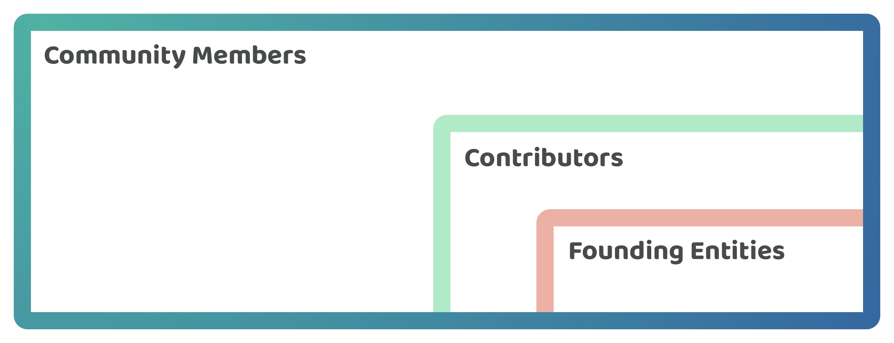
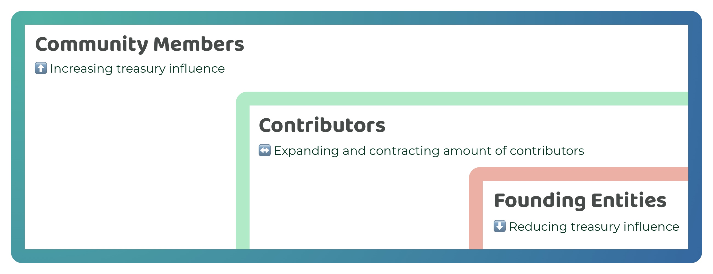

# Stakeholders

Web3 ecosystems have three different stakeholders that are worth discussing to explore how they  might participate and contribute towards a treasuries decisions and operation.

<figure><figcaption>
Web3 ecosystem stakeholders
</figcaption></figure>

**Community members**

* **Who are they** - Community members include anyone that participates in the ecosystem. This could mean anyone that attends ecosystem events, owns any coins or tokens, uses any of the protocols or applications available or has any other form of interest or participation in the ecosystem. Both contributors and members of the founding entities would also be classed as community members.
* **Treasury involvement** - Community members may or may not be able to participate in treasury decisions depending on how an ecosystem manages their treasury. Even if the community members are able to participate in these decisions a number of those members may not be interested in participating in these decisions or related activities. For ecosystems that are prioritising decentralisation of the treasury, a longer term goal for the ecosystem will be increasing the participation of community members by enabling them to participate in voting on any important treasury decisions. This could also mean giving them the possibility to delegate their vote to another community representative. Community members could range from being very engaged to very passive when participating in any treasury processes across Web3 ecosystems.

**Contributors**

* **Who are they** - Contributors are anyone that helps with supporting or improving the ecosystem. This could mean working on the infrastructure, growth or events related to the ecosystem. It would also naturally include anyone who contributes towards operating the treasury itself.
* **Treasury involvement** - There are usually many important areas that require contribution efforts in a Web3 ecosystem such as the infrastructure that supports the networks operation. This means it will be fairly common that only a subset of ecosystem contributors will directly be helping with operating the treasury systems and processes. Contributors that work on operating the treasury could be selected by a founding entity or be elected through community governance. In terms of payment for these contributors, this could come from the founding entities or through treasury funds. There is an amount of time commitment involved with becoming a contributor in these ecosystems as those interested would need to develop a certain level of skill and knowledge to effectively contribute towards improving and maintaining the treasury systems and processes.

**Founding entities**

* **Who are they** - The founding entities are any entity that was setup at the beginning to help with the growth and development of the ecosystem. The original founders may or may not still be involved with the ecosystem however the founding entities will often have some level of influence over the ecosystem and how the treasury is operated and how assets get disbursed. For some ecosystems this can come in the form of a foundation that handles ecosystem treasury assets which the founding entity is then fully responsible for. For other ecosystems the founding entities could be in the process of creating a decentralised treasury system where the control over that system itself may or may not have been fully handed over to the community whilst it's still being developed.
* **Treasury involvement** - Founding entities will often be the most highly engaged and responsible for an ecosystems treasury, in the beginning the founding entities are needed to setup any initial systems and processes.

### Long term considerations

Further considerations can be made about the ecosystems that have the longer term goal of increasing the amount of decentralisation in how their treasury is operated.

<figure><figcaption></figcaption></figure>

**Community influence on treasury decisions should increase over time**

Increasing decentralisation of the treasury will mean pushing decisions about how community assets are used to the edges of the community. To achieve this, the amount of participation from the community members in treasury decisions should ideally increase over time. The creation of systems that invite community participation in a way that is easy to use and that is inclusive will be important for achieving this outcome. Treasury decisions that the community could be concerned with include where funds are being disbursed, which contributors are being elected to help with operating the treasury and what treasury system parameter changes might be needed.

**Contributors involvement in the treasuries operation should increase over time**

For a Web3 ecosystem to become more decentralised the responsibility of contributors who help with the operation of the treasury should increase over time. This will mean creating solutions that allow for more of the operational control of the treasury to be handled by contributors in the ecosystem rather than from the founding entities. This means reducing the founding entities influence over time and increasing the contributors that the community is selecting themselves.

**Founding entities influence should reduce over time**

Reducing the control and influence of the founding entities over time will help with increasing the amount of decentralisation of the network and give the community more stewardship over how the treasury is operated. One way this can be achieved is if the community can select which contributors get compensated for helping to support and improve the operation of the treasury. Another way the founding entities influence could be further reduced is if contributors working in these entities are able to migrate to different funding mechanisms where they can be elected and compensated through the treasury itself using community governance rather than being funded by the founding entity.

**Number of contributors can expand or contract in response to the needs of the ecosystem**

The treasury systems and processes may require more or less contribution effort over time as the systems and processes start to mature and as the external environment changes. Due to a constantly changing environment it could be expected to see the number of contributors involved in the operation of the treasury to expand and contract based on the needs of the ecosystem at a given moment in time.

### Long term importance of contributors for Web3 treasuries

**Community members have high flexibility to move to other ecosystems**

Web3 ecosystems are inherently digital first networks. Anyone can participate and use these networks for their own benefit. This means community members are easily able to use and benefit from multiple ecosystems and can fully migrate from one ecosystem to another. This reality helps to highlight the importance of ecosystems being able to attract and retain quality contributors so that ecosystem can continue to grow and develop at a similar or faster pace than its competitors.

**The skill and competence of an ecosystems contributors will highly impact how it evolves and improves over time**

Both nation states and corporations require highly skilled professionals that are competent in contributing towards the overall success and daily operation of these organisations. In a similar vein, the skill level and competence of the contributors involved in different Web3 ecosystems will also be highly influential on the long term evolution and success of these ecosystems. Ultimately it will be the people who are actually contributing towards improving these emerging Web3 ecosystems that end up creating the right incentives and reasons for community members to engage and participate in an ecosystem over the long term.
